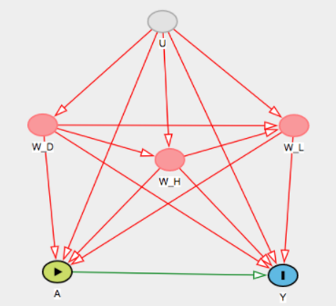
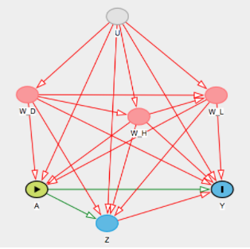
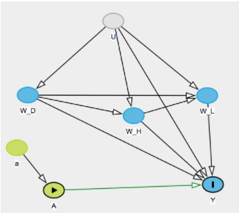
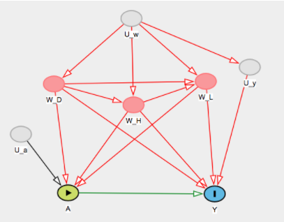
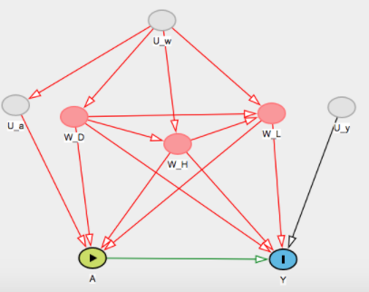

\pagebreak  

```{r loading_packages, message=FALSE, echo = FALSE}
require(mosaic)
```

#Step 0: Specify the Scientific Question  

##Background  

50-70 million Americans have chronic sleep problems and 35.5% of adults report getting less than 7 hours of sleep a day [@cdc].  Everyone knows the implications of not getting enough sleep. It has been linked to many health problems such as obesity, mood disorders, and heart disease [@wgbh]. Getting a good night’s sleep gives the body the necessary time to recover and is shown to improve memory [@wgbh2]. People across the country test herbal supplements, meditation and prescription drugs to fight insomnia. However, some studies have shown that exercise alone can help improve the quality of sleep [@sleepfoundation]. We set out to examine this relationship and see if exercise does indeed cause better sleep quality.  


##The Data

Our data come from the National Health and Nutrition Examination Survey conducted by the US National Center for Health Statistics and can found in the `NHANES` package in R. These data were collected between the years of 2009 and 2012 across the United States. It includes information on a variety of diseases, medical conditions, and health indicators. The original set has 76 variables and 10,000 observations [@nhanes].  

The `NHANES` includes duplicate rows in order to fix problems associated with oversampling. We decided to remove these duplicates. We also ran a series of stepwise regressions to identify key covariates. After these reductions, we have a final dataset with 10 variables and 4,654 observations. Unfortunately, although this dataset has information on multiple years, the participants all have unique identifiers and thus can not be analyzed in a longitudinal setting. `NA`s were transformed as factor levels labeled as "Undisclosed."  

##The Variables  

### Exposure

- `PhysActive`: is a binary variable ($Yes=1$, $No=0$) representing whether the participant does moderate or vigorous-intensity sports, fitness or recreational activities.

### Outcome

- `SleepTrouble`: is a binary variable ($Yes=1$, $No=0$) representing whether the participant has reported having trouble sleeping to a healthcare professional.

### Covariates

#### Demographic Covariates

1. `Gender`: is a binary variable ($Female=0$, $Male=1$) representing the gender of the participant.
2. `Race1`: categorical variable representing the reported race of participant: `Mexican`, `Hispanic`, `White`, `Black`,`Other`.
3. `MaritalStatus`: categorical variable representing the reported marital status of study participant: `Married`, `Widowed`, `Divorced`, `Separated`, `NeverMarried`, `LivePartner`.

#### Health Covariates

4. `HealthGen`: categorical variable representing self-reported rating of participant's health in general: `Excellent`, `Vgood`, `Good`, `Fair`, `Poor`.
5. `DaysPhysHlthBad`: numeric variable representing the self-reported number of days participant's physical health was not good out of the past 30 days.
6. `DaysMentHlthBad`: numeric variable representing the self-reported number of days participant's mental health was not good out of the past 30 days.
7. `LittleInterest`: categorical variable representing the self-reported number of days participant had little interest in doing things: `None`, `Several`, `Majority`,`AlmostAll`.
8. `Depressed`: categorical variable representing the self-reported number of days participant felt down, depressed or hopeless: `None`, `Several`, `Majority`,`AlmostAll`.

#### Lifestyle Covariates


9. `RegularMarij`: binary variable ($Yes=1$, $No=0$) representing whether the participant has been or is a regular marijuana user (used at least once a month for a year).
10. `HardDrugs`: binary variable ($Yes=1$, $No=0$) representing whether the participant hs tried cocaine, crack cocaine, heroin or metamphetamine.


##Scientific Question and Target Population  

Among American adults aged 20 years or older, how does participating in moderate or vigorous-intensity sports, fitness or recreational activities affect sleep quality?


#Step 1: Specify the Causal Model    

##Option 1  

Our endogenous variables are X = {W, A, Y} which are defined as:  

W= {$W_d, W_h, W_l$}  
$W_d$ = {Gender, Age, Race1, Education, MaritalStatus, HHIncomeMid, HomeOwn}  
$W_h$ = {HealthGen, DaysPhysHlthBad, DaysMentHlthBad, LittleInterest, Depressed}  
$W_l$ = {TVHrsDay, CompHrsDay, AlcoholDay, SmokeNow, RegularMarij, HardDrugs}  
A = {PhysActive}  
Y = {SleepTrouble}    

Our exogenous variables are U = ${U_{W_d}, U_{W_h}, U_{W_l}, U_A, U_Y} ~ P_U$. These are the unmeasured factors which influence what values our endogenous variables, X can take. 

Our structural causal model is defined as:

$W_d = f_{W_d}(U_{W_d})$  
$W_h = f_{W_h}(W_d, U_{W_h})$  
$W_l = f_{W_l}(W_d, W_h, U_{W_l})$  
$A = f_A(W_d, W_h, W_l, U_A)$  
$Y = f_Y(W_d, W_h, W_l, A, U_Y)$    

A directed acyclic graph displays this SCM below.  

  

##Option 2  

Our endogenous variables X = {W, A, Z, Y} which are defined as:

W = {$W_d, W_h, W_l$}  
$W_d$ = {Gender, Age, Race1, Education, MaritalStatus, HHIncomeMid, HomeOwn}  
$W_h$ = {HealthGen, DaysPhysHlthBad, DaysMentHlthBad, LittleInterest}  
$W_l$ = {TVHrsDay, CompHrsDay, AlcoholDay, SmokeNow, RegularMarij, HardDrugs}  
A = {PhysActive}  
Z = {Depressed}  
Y = {SleepTrouble}  

Our exogenous variables are U = {$U_{W_d}, U_{W_h}, U_{W_l}, U_A, U_Z U_Y$} $\sim P_U$. These are the unmeasured factors which influence what values our endogenous variables, X can take. 

Our structural causal model is defined as:

$W_d = f_{W_d}(U_{W_d})$  
$W_h = f_{W_h}(W_d, U_{W_h})$  
$W_l = f_{W_l}(W_d, W_h, U_{W_l})$  
$A = f_A(W_d, W_h, W_l, U_A)$  
$Z = f_Z(W_d, W_h, W_l, A, U_Z)$  
$Y = f_Y(W_d, W_h, W_l, A, Z, U_Y)$  

A directed acyclic graph displays this SCM below.   

  

This alternative model defines Depressed as an intermediary between the exposure and outcome. Both models are valid, however we will proceed with the first model in the following analyses.  


#Step 2: Translation in the Target Causal Parameter Using Counterfactuals    

Here, our intervention node A is physical activity. This is forcing each participant to either do moderate to vigorous physical activity or do no physical activity. 


Our post-intervention SCM is then:

$W_d = f_{W_d}(U_{W_d})$  
$W_h = f_{W_h}(W_d, U_{W_h})$  
$W_l = f_{W_l}(W_d, W_h, U_{W_l})$  
A = a  
$Y_a = f_{W_l}(W_d, W_h, W_l, a, U_Y)$    


  

The counterfactuals we are interested in are $Y_A: a \ \in A$ where A = {0,1}. Ya represents the individual’s SleepTrouble if possibly contrary to fact, they received the intervention A = a. 

Our causal parameter is the causal risk difference in SleepTrouble if every participant did moderate-vigorous physical activity vs. if no participant did physical activity. This can be written as:   

$$\Psi^F(P_{U,X}) = P_{U,X}(Y_1=1) - P_{U,X}(Y_0=1) = E_{U,X}(Y_1) - E_{U,X}(Y_0)$$  

  


#Step 3: Specify the Observed Data and its Link 

Our observed data consists of 4,654 independent and identically distributed copies of the random variable O which follows the distribution $P_O$. O = {$W_l, W_d, W_h, A, Y$} $\sim P_O$ where $W_l$ consists of the lifestyle covariates, $W_h$ consists of the health covariates, $W_d$ consists of the demographic covariates, A is the intervention node of physical activity, and Y is the outcome variable representing sleep trouble. We can assume that our observed data comes from 4,654 i.i.d. samples from the data generating process described by $M^F$. This links our causal $M^F$ with the statistical model $M$. This model $M$ does not have any restrictions and is therefore non-parametric. 

#Step 4: Indentifiability    

##Convenience Assumptions  

Our target causal parameter  is not identified under the initial SCM. The backdoor criterion does not hold as there are several unblocked back-door paths between Y and A. However, a few additional assumptions make the target causal parameter identifiable. One set of sufficient, but not necessarily minimal, assumptions that could be made are as follows:  

> 1) The unmeasured factors contributing to the exposure A are independent of the unmeasured factors contributing to the outcome Y This can be written as $U_A \perp U_Y$.    

> 2) We would also need either $U_A$ independent of the remaining $U_W$ or $U_Y$ independent of the remaining $U_W$. As with the previous condition, these are very strong assumptions to make. This can be written as $U_A \perp U_W$ or $U_Y \perp U_W$.   


    
      

##Plausibility  

The assumptions outlined above are strictly convenience assumptions and in the context of this study, are slightly extreme/implausible. For example, given the large number of factors that affect a person’s quality of sleep, it seems very likely that physical activity and sleep trouble have common unmeasured contributors. One such variable, that is not explicitly measured, is the participant’s occupation/profession. The stress levels a person experiences from their job could profoundly influence both their physical activity/exercise habits and their sleep quality. In the absence of any data on this variable, identifying it as an unmeasured confounder appears to be the best course of action. However, these convenience assumptions are made in the interest of allowing our analysis to progress, and to arrive at a statistical parameter to define the causal relationship. Thus, after making these convenience assumptions satisfies the randomization assumption and the counterfactual risk $P_{U,X}(Ya= y|A= a, W= w)$ is identified as the observed risk of disturbed sleep among those exposed within a given strata of covariates w. After conditioning on the covariates W, the backdoor criterion would hold and MF  would be identifiable.    

##How to Improve Plausibility  

One way to improve the plausibility of these assumptions is to measure all possible determinants of `SleepTrouble` as accurately as possible, starting with a thorough literature search to identify said determinants. An additional benefit of conducting a thorough literature search is the opportunity to better delineate the known relationship between the exposure and covariates and /or the outcome and the covariates, in order to minimize the number of factors included as unmeasured confounders in the model.  


#Step 5: The Statistical Model and Estimand    

##The Estimand  

After making the necessary independence assumptions, the augmented SCM is denoted as $M^{F*}$, as an acknowledgement of the convenience assumptions made to ensure identifiability. Under this augmented (working) SCM, the statistical estimand (the causal risk difference) is defined as:   

$$\Psi(P_0) = E_0\big[E_0(Y|A=1, W=w) - E_0(Y|A=0, W=w)\big]$$  
$$\sum\bigg[E_0(Y|A=1, W=w) - E_0(Y|A=0, W=w)\bigg]\cdot P_0(W=w)$$  

##Positivity Assumptions    

###Definition  

The positivity assumption states that each expouse of interest must occur with a positive probability for each possible value of the covariates. This can be written as:  

$$\min_{a \in A}P_0(A=a|W=w) > 0, \text{ for all w which } P_0(W=w) > 0$$   

###Violations   

We may worry about theoretical violations of this assumption because not every covariate combination is likely observed. For example, it may be contraindicated for someone who has poor general health to have done moderate/vigorous physical activity in the past month, meaning $P_0(A=1|HealthGen = Poor)=0$.  

Practical violations of the positivity assumption are quite possible, given the large number of covariate categories (11 covariates) and the relatively small number of participants in the study. For example, in our sample $P_n$ of $P_0$ it may be such that there are no observations of depressed participants who exercised within the last 30 days. In this case, $P_n(A=1|Depressed = 1)$. While every category combination was not examined, it is quite possible in our dataset that enough support does not exist for some category combinations.  

#Step 6: Estimation  

##Unadjusted Estimator    

$$\Psi^{unadjusted} = E_n(Y|A=1) - E_n(Y|A=0)$$  

```{r}
load("obs_data_v3.Rda")
a0 <- filter(ObsData, PhysActive == 0)
a1 <- filter(ObsData, PhysActive == 1)
E_a0 <- mean(as.numeric(a0$SleepTrouble))
E_a1 <- mean(as.numeric(a1$SleepTrouble))
psi.un <- E_a1 - E_a0
```    


Our estimate for $\Psi_{unadjusted}$ = `r round(psi.un, 5)`. This can be interpreted as the expected difference in risk of having sleep trouble for those who did moderate to vigorous physical activity vs. those who did not, without adjusting for any of the covariates. 


##Simple Substitution Estimator Using G-Comp    


$$\Psi_{SS}(\hat{P}) =\frac{1}{n} \sum^n_{i =1}\hat{\bar{Q}}(1, W_i) - \hat{\bar{Q}}(0, W_i)$$    

We will define $\hat{\bar{Q}}(Y|A,W) = logit^{-1} (\beta_0+ \beta_1PhysAcitve + \beta_2 Gender + \beta_3 Race + \beta_4 LittleInterest + \beta_5HealthGen + \beta_6DaysPhysHlthBad + \beta_7DaysMentHlthBad + \beta_8 Depressed + \beta_9 Marital Status + \beta_10 RegularMarij + \beta_11 HardDrugs )$.  


```{r}
model <- glm(SleepTrouble ~ ., 
    data = ObsData, family = "binomial")
#summary(model)

txt <- mutate(ObsData, PhysActive = 1)
control <- mutate(ObsData, PhysActive = 0)

predict.txt <- predict(model, newdata = txt, type = 'response')
predict.control <- predict(model, newdata = control, type = 'response')
ObsData.SS <- mutate(ObsData, txt = predict.txt, control = predict.control)
psi.SS <- mean(predict.txt - predict.control)
```  

Our estimate for $\Psi_{SS}$ = `r round(psi.SS, 5)`. 


##Inverse Probability Treatment Weighting  

##Targeted Maximum Likelihood Estimator  

##Non-Parametric Bootstrap    

```{r interations_500, eval=FALSE}
R <- 500
n <- 200

estimates <- matrix(nrow = R, ncol = 3)
for (r in 1:R){
  obs <- sample(x = ObsData, size = n, replace = FALSE)
  txt <- mutate(obs, PhysActive = 1)
  control <- mutate(obs, PhysActive = 0)
  
 model1 <- glm(SleepTrouble ~ ., 
    data = ObsData, family = "binomial")
  
  Q1w.1 <- predict(model1, newdata = txt, type = 'response')
  Q0w.1 <- predict(model1, newdata = control, type = 'response')

  
  psi.hat1 <- mean(Q1w.1 - Q0w.1)

  
  estimates[r,1] <- c(psi.hat1)
}

mean.psi1 <- mean(estimates[,1])
var.psi1 <- var(estimates[,1])
```  


#Step 7: Interpretation  

# References  


