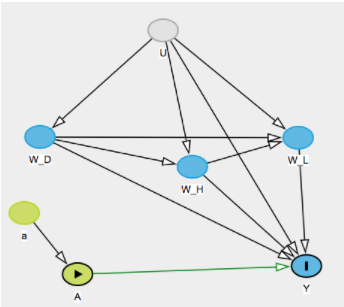
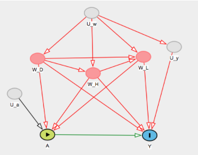

\pagebreak  

```{r loading_packages, message=FALSE, echo = FALSE, warning=FALSE}
require(mosaic)
library(knitr)
```

#Step 0: Specify the Scientific Question  

##Background  

50-70 million Americans have chronic sleep problems and 35.5% of adults report getting less than 7 hours of sleep a day [@cdc].  Everyone knows the implications of not getting enough sleep. It has been linked to many health problems such as obesity, mood disorders, and heart disease [@wgbh]. Getting a good night’s sleep gives the body the necessary time to recover and is shown to improve memory [@wgbh2]. People across the country test herbal supplements, meditation and prescription drugs to fight insomnia. However, some studies have shown that exercise alone can help improve the quality of sleep [@sleepfoundation]. We set out to examine this relationship and see if exercise does indeed cause better sleep quality.  


##The Data

Our data come from the National Health and Nutrition Examination Survey conducted by the US National Center for Health Statistics and can found in the `NHANES` package in R. These data were collected between the years of 2009 and 2012 across the United States. It includes information on a variety of diseases, medical conditions, and health indicators. The original set has 76 variables and 10,000 observations [@nhanes].  

We decided to include 17 of the original 76 variables, and we restricted the population to individuals who are at least 20 years old (since most of the relevant covariates are missing for younger individuals).

The `NHANES` includes duplicate rows in order to fix problems associated with oversampling. We decided to remove these duplicates.  After these reductions, we have a final dataset with 15 variables and 4,630 observations. Unfortunately, although this dataset has information on multiple years, the participants all have unique identifiers and thus can not be analyzed in a longitudinal setting. `NA`s were transformed as factor levels labeled as "Undisclosed".  

##The Variables  

### Exposure

- `PhysActive`: is a binary variable ($Yes=1$, $No=0$) representing whether the participant does moderate or vigorous-intensity sports, fitness or recreational activities.

### Outcome

- `SleepTrouble`: is a binary variable ($Yes=1$, $No=0$) representing whether the participant has reported having trouble sleeping to a healthcare professional.

### Covariates

#### Demographic Covariates

1. `Gender`: is a binary variable ($Female=0$, $Male=1$) representing the gender of the participant.
2. `Age`: is a numeric variable representing the age in years at screening of study participant. Note that we do not consider participants younger than $20$, and participants older than $80$ were recorded as $80$.
3. `Race1`: categorical variable representing the reported race of participant: `Mexican`, `Hispanic`, `White`, `Black`,`Other`.
4. `Education`: categorical variable representing the reported educational level of study participant: `8thGrade`, `9-11Grade`, `HighSchool`, `SomeCollege`, `CollegeGrad`.
5. `MaritalStatus`: categorical variable representing the reported marital status of study participant: `Married`, `Widowed`, `Divorced`, `Separated`, `NeverMarried`, `LivePartner`.
6. `HomeOwn`: categorical variable representing whether the home of study participant is owned, rented or occupied by some other arrangement: `Home`, `Rent`, `Other`.

#### Health Covariates

7. `HealthGen`: categorical variable representing self-reported rating of participant's health in general: `Excellent`, `Vgood`, `Good`, `Fair`, `Poor`.
8. `DaysPhysHlthBad`: numeric variable representing the self-reported number of days participant's physical health was not good out of the past 30 days.
9. `DaysMentHlthBad`: numeric variable representing the self-reported number of days participant's mental health was not good out of the past 30 days.
10. `LittleInterest`: categorical variable representing the self-reported number of days participant had little interest in doing things: `None`, `Several`, `Majority`,`AlmostAll`.
11. `Depressed`: categorical variable representing the self-reported number of days participant felt down, depressed or hopeless: `None`, `Several`, `Majority`,`AlmostAll`.

#### Lifestyle Covariates

12. `AlcoholDay`: numeric variable representing the reported average number of drinks consumed on days that participant drank alcohol beverages.
13. `SmokeNow`: binary variable ($Yes=1$, $No=0$) representing whether the participant currently smokes cigarettes regularly.
14. `RegularMarij`: binary variable ($Yes=1$, $No=0$) representing whether the participant has been or is a regular marijuana user (used at least once a month for a year).
15. `HardDrugs`: binary variable ($Yes=1$, $No=0$) representing whether the participant hs tried cocaine, crack cocaine, heroin or metamphetamine.


##Scientific Question and Target Population  

Among American adults aged 20 years or older, how does participating in moderate or vigorous-intensity sports, fitness or recreational activities affect sleep quality?

#Step 1: Specify the Causal Model    

##Option 1  

Our endogenous variables are X = {W, A, Y} which are defined as:  

W= {$W_d, W_h, W_l$}  
$W_d$ = {Gender, Age, Race1, Education, MaritalStatus, HomeOwn}  
$W_h$ = {HealthGen, DaysPhysHlthBad, DaysMentHlthBad, LittleInterest, Depressed}  
$W_l$ = {AlcoholDay, SmokeNow, RegularMarij, HardDrugs}  
A = {PhysActive}  
Y = {SleepTrouble}    

Our exogenous variables are U = ${U_{W_d}, U_{W_h}, U_{W_l}, U_A, U_Y} ~ P_U$. These are the unmeasured factors which influence what values our endogenous variables, X can take. 

Our structural causal model is defined as:

$W_d = f_{W_d}(U_{W_d})$  
$W_h = f_{W_h}(W_d, U_{W_h})$  
$W_l = f_{W_l}(W_d, W_h, U_{W_l})$  
$A = f_A(W_d, W_h, W_l, U_A)$  
$Y = f_Y(W_d, W_h, W_l, A, U_Y)$    

A directed acyclic graph displays this SCM below.  

  

##Option 2  

Our endogenous variables X = {W, A, Z, Y} which are defined as:

W = {$W_d, W_h, W_l$}  
$W_d$ = {Gender, Age, Race1, Education, MaritalStatus, HomeOwn}  
$W_h$ = {HealthGen, DaysPhysHlthBad, DaysMentHlthBad, LittleInterest} 
$W_l$ = {AlcoholDay, SmokeNow, RegularMarij, HardDrugs}  
A = {PhysActive}  
Z = {Depressed}  
Y = {SleepTrouble}  

Our exogenous variables are U = {$U_{W_d}, U_{W_h}, U_{W_l}, U_A, U_Z U_Y$} $\sim P_U$. These are the unmeasured factors which influence what values our endogenous variables, X can take. 

Our structural causal model is defined as:

$W_d = f_{W_d}(U_{W_d})$  
$W_h = f_{W_h}(W_d, U_{W_h})$  
$W_l = f_{W_l}(W_d, W_h, U_{W_l})$  
$A = f_A(W_d, W_h, W_l, U_A)$  
$Z = f_Z(W_d, W_h, W_l, A, U_Z)$  
$Y = f_Y(W_d, W_h, W_l, A, Z, U_Y)$  

A directed acyclic graph displays this SCM below.   

  

This alternative model defines Depressed as an intermediary between the exposure and outcome. Both models are valid, however we will proceed with the first model in the following analyses.  


#Step 2: Translation in the Target Causal Parameter Using Counterfactuals    

Here, our intervention node A is physical activity. This is forcing each participant to either do moderate to vigorous physical activity or do no physical activity. 

Our post-intervention SCM is then:

$W_d = f_{W_d}(U_{W_d})$  
$W_h = f_{W_h}(W_d, U_{W_h})$  
$W_l = f_{W_l}(W_d, W_h, U_{W_l})$  
A = a  
$Y_a = f_{W_l}(W_d, W_h, W_l, a, U_Y)$    


  

The counterfactuals we are interested in are $Y_A: a \ \in A$ where A = {0,1}. Ya represents the individual’s SleepTrouble if possibly contrary to fact, they received the intervention A = a (i.e. physically active or not). 

Our causal parameter is the causal risk difference in SleepTrouble if every participant did moderate-vigorous physical activity vs. if no participant did physical activity. This can be written as:   

$$\Psi^F(P_{U,X}) = P_{U,X}(Y_1=1) - P_{U,X}(Y_0=1) = E_{U,X}(Y_1) - E_{U,X}(Y_0)$$  

  


#Step 3: Specify the Observed Data and its Link 

Our observed data consists of 4,630 independent and identically distributed copies of the random variable O which follows the distribution $P_O$. O = {$W_l, W_d, W_h, A, Y$} $\sim P_O$ where $W_l$ consists of the lifestyle covariates, $W_h$ consists of the health covariates, $W_d$ consists of the demographic covariates, A is the intervention node of physical activity, and Y is the outcome variable representing sleep trouble. We can assume that our observed data comes from 4,630 i.i.d. samples from the data generating process described by $M^F$. This links our causal $M^F$ with the statistical model $M$. This model $M$ does not have any restrictions and is therefore non-parametric. 

#Step 4: Indentifiability    

##Convenience Assumptions  

Our target causal parameter  is not identified under the initial SCM. The backdoor criterion does not hold as there are several unblocked back-door paths between Y and A. However, a few additional assumptions make the target causal parameter identifiable. One set of sufficient, but not necessarily minimal, assumptions that could be made are as follows:  

> 1) The unmeasured factors contributing to the exposure A are independent of the unmeasured factors contributing to the outcome Y This can be written as $U_A \perp U_Y$.    

> 2) We would also need either $U_A$ independent of the remaining $U_W$ or $U_Y$ independent of the remaining $U_W$. As with the previous condition, these are very strong assumptions to make. This can be written as $U_A \perp U_W$ or $U_Y \perp U_W$.   


    
      

##Plausibility  

The assumptions outlined above are strictly convenience assumptions and in the context of this study, are slightly extreme/implausible. For example, given the large number of factors that affect a person’s quality of sleep, it seems very likely that physical activity and sleep trouble have common unmeasured contributors. One such variable, that is not explicitly measured, is the participant’s occupation/profession. The stress levels a person experiences from their job could profoundly influence both their physical activity/exercise habits and their sleep quality. In the absence of any data on this variable, identifying it as an unmeasured confounder appears to be the best course of action. However, these convenience assumptions are made in the interest of allowing our analysis to progress, and to arrive at a statistical parameter to define the causal relationship. Thus, after making these convenience assumptions satisfies the randomization assumption and the counterfactual risk $P_{U,X}(Ya= y|A= a, W= w)$ is identified as the observed risk of disturbed sleep among those exposed within a given strata of covariates w. After conditioning on the covariates W, the backdoor criterion would hold and MF  would be identifiable.    

##How to Improve Plausibility  

One way to improve the plausibility of these assumptions is to measure all possible determinants of `SleepTrouble` as accurately as possible, starting with a thorough literature search to identify said determinants. An additional benefit of conducting a thorough literature search is the opportunity to better delineate the known relationship between the exposure and covariates and /or the outcome and the covariates, in order to minimize the number of factors included as unmeasured confounders in the model.  


#Step 5: The Statistical Model and Estimand    

##The Estimand  

After making the necessary independence assumptions, the augmented SCM is denoted as $M^{F*}$, as an acknowledgement of the convenience assumptions made to ensure identifiability. Under this augmented (working) SCM, the statistical estimand (the causal risk difference) is defined as:   

$$\Psi(P_0) = E_0\big[E_0(Y|A=1, W=w) - E_0(Y|A=0, W=w)\big]$$  
$$\sum\bigg[E_0(Y|A=1, W=w) - E_0(Y|A=0, W=w)\bigg]\cdot P_0(W=w)$$  

##Positivity Assumptions    

###Definition  

The positivity assumption states that each expouse of interest must occur with a positive probability for each possible value of the covariates. This can be written as:  

$$\min_{a \in A}P_0(A=a|W=w) > 0, \text{ for all w which } P_0(W=w) > 0$$   

###Violations   

We may worry about theoretical violations of this assumption because not every covariate combination is likely observed. For example, it may be contraindicated for someone who has poor general health to have done moderate/vigorous physical activity in the past month, meaning $P_0(A=1|HealthGen = Poor)=0$.  

Practical violations of the positivity assumption are quite possible, given the large number of covariate categories (11 covariates) and the relatively small number of participants in the study. For example, in our sample $P_n$ of $P_0$ it may be such that there are no observations of depressed participants who exercised within the last 30 days. In this case, $P_n(A=1|Depressed = 1)$. While every category combination was not examined, it is quite possible in our dataset that enough support does not exist for some category combinations.  

#Step 6: Estimation  

```{r, warning=FALSE, message=FALSE, cache=TRUE}

# load cleaned data set
load('obs_data_v4.Rda')

ObsData <- obs.data
n <- nrow(ObsData)
set.seed(12345)

# load superlearner library and specify the packages
library(SuperLearner)

SL.library <- c("SL.mean", "SL.glm", "SL.bayesglm", "SL.step", "SL.rpartPrune")
```

- Our choice of libraries for Super Learner was based on GLMs as our linear models. Stepwise regression was chosen because of its systematic variable selection feature. Decision trees were used to diversify the SL library.

## Unadjusted estimator

```{r, warning=FALSE, message=FALSE, cache=TRUE}
a0 <- filter(ObsData, PhysActive == 0)
a1 <- filter(ObsData, PhysActive == 1)
E_a0 <- mean(as.numeric(a0$SleepTrouble))
E_a1 <- mean(as.numeric(a1$SleepTrouble))

Psihat.un <- E_a1 - E_a0
Psihat.un
```

## Simple Substitution Estimator

```{r, message=FALSE, warning=FALSE, cache=TRUE}
# estimate conditional mean outcome
X <- ObsData[,-2]
X1 <- X0 <- X
X1$PhysActive <- 1
X0$PhysActive <- 0
  
# estimation using SL
QbarSL <- SuperLearner(Y=ObsData$SleepTrouble, X=X, SL.library = SL.library,
                         family='binomial', cvControl=list(V=10))

QbarSL

#evaluate performance using CV.SL
CV.SL.out <- CV.SuperLearner(Y=ObsData$SleepTrouble, X=X, SL.library = SL.library,
                             family='binomial', cvControl=list(V=10))

summary(CV.SL.out)

# initial estimates of the outcome , given observed exposure and covariates
QbarAW <- predict(QbarSL, newdata=X)$pred
Qbar1W <- predict(QbarSL, newdata=X1)$pred 
Qbar0W <- predict(QbarSL, newdata=X0)$pred
  
# Simple Substitution estimator
Psihat.SS <- mean(Qbar1W - Qbar0W)
Psihat.SS
```


## IPTW estimator

```{r, warning=FALSE, message=FALSE, cache=TRUE}
# estimate exposure mechanism g(A|W)

gHatSL <- SuperLearner(Y=ObsData$SleepTrouble, X=X[,-1], cvControl=list(V=10),
                       SL.library=SL.library, family = 'binomial')

# get predicted prob of exposure given baseline covariates
gHat1W <- gHatSL$SL.predict
gHat0W <- 1 - gHat1W

# store probabilities
gHatAW <- rep(NA,n)
gHatAW[ObsData$PhysActive==1] <- gHat1W[ObsData$PhysActive==1]
gHatAW[ObsData$PhysActive==0] <- gHat1W[ObsData$PhysActive==0]

# look at distribution of probs
summary(gHatAW) 

# generate clever covariate
H.AW<- as.numeric(ObsData$PhysActive==1)/gHat1W - as.numeric(ObsData$PhysActive==0)/gHat0W

# look at distribution of weights
summary(H.AW)

H.1W <- 1/gHat1W
H.0W <- -1/gHat0W

# compute IPTW estimator
Psihat.IPTW <- mean(H.AW*ObsData$SleepTrouble)
Psihat.IPTW
```


## TMLE estimator

```{r, warning=FALSE, message=FALSE, cache=TRUE}
# update the initial estimator of Qbar(A,W)
logitUpdate <- glm(ObsData$SleepTrouble ~ -1 + offset(qlogis(QbarAW)) + H.AW,
                   family='binomial')
epsilon <- logitUpdate$coef

QbarAW.star<- plogis(qlogis(QbarAW)+ epsilon*H.AW)
Qbar1W.star<- plogis(qlogis(Qbar1W)+ epsilon*H.1W)
Qbar0W.star<- plogis(qlogis(Qbar0W)+ epsilon*H.0W)

# compute TMLE estimator
Psihat.TMLE <- mean(Qbar1W.star - Qbar0W.star)
Psihat.TMLE

# pack and display all four estimates
estimates <- data.frame(cbind(Psihat.un, Psihat.SS, Psihat.IPTW, Psihat.TMLE))*100
kable(estimates, row.names=FALSE)
```


## Non-parametric Bootstrap

- In here, we present our results from the non-parametric Bootstrap to assess the variance of the 4 estimators presented in the previous sections. The R code used to generate the results is included in the Appendix.  

- We generate `B=500` bootstrap samples and compute the 4 estimators (**unadjusted, Simple Substitution, IPTW and TMLE**) using SuperLearner. The table and plots below summarize the results.

  


#Step 7: Interpretation  

- The point estimates from the the four estimators are 
```{r, warning=FALSE, message=FALSE, echo=FALSE}
kable(estimates, row.names=FALSE)
```

- The results of the analysis present some evidence suggesting the existence of an association  between self-reported participation in moderate to vigorous physical activity and self-reported disturbances in sleep. The unadjusted estimator, estimating the difference in the risk of reporting disturbed sleep between those reporting engaging in moderate to vigorous physical activity and those who did not was approximately **-2.44%**, not adjusting for any confounders in the data. This suggests that engaging in moderate to vigorous physical activity lowers the chances of disturbed sleep. These results are, somewhat counterintuitively, reversed after adjusting for common confounders, including demographic , health and lifestyle covariates. After adjustment, the simple substitution estimator, estimated by SuperLearner, suggested that this difference in the probability of reporting disturbed sleep is approximately **+3.34%**. 

-  The point estimates from the three estimators (SS, IPTW, TMLE) are positive, suggesting that doing physical activitiy is associated with a higher risk of reporting troubled sleep. The magintudes of the point estimates are close for SS and TMLE, however the IPTW estimate is a whole order of magnitude higher. This can be explained by "near" violations of the positivity assumptions which is a common failure mode for IPTW. 

- After performing the non-parametric bootstrap to estimate the variance and compute 95% confidence intervals, we start seeing some more interesting patterns. IPTW is highly variable and seems unstable, again this is due to "near" violations of positivity assumptions in the different bootstrap samples. We also observe a noticeable decrease in the magnitude of the estimates compared to the non-bootstrapped results. TMLE bootstrapped estimate dropped to a negative value of **-1.03%** with a 95% CI (from quantiles) of **[-5.32, 2.246]**. Similarly for SS, the estimate drops to **+2.15%** with 95% CI of **[-0.04, 4.22]**. Since both CIs include **0**, it is difficult to formulate a definite conclusion about the association between physical activity and reported sleep trouble for the population under study. Further investigation and analysis is required to extract more meaningful conclusions about our research question. 

- In the context of the structural causal model, the results can be interpreted as the difference in counterfactual probability of reporting disturbed sleep when all the participants, possible contrary to fact, engage in physical activity, compared to the counterfactual scenario where none of the participants engage in physical activity. In order to interpret the results in the context of our causal model, the randomization assumption made regarding the absence of unmeasured common factors between physical activity and disturbed sleep patterns needs to be met. In addition, there must be no common unmeasured confounders between either the covariates and the exposure, physical activity, or between the covariates and the outcome, disturbed sleep. These assumptions are impossible to confirm or refute under the conditions in which the data was collected, thus limiting the interpretation of a causal association between physical activity and sleep patterns. One way to improve the plausibility of this causal association is to delineate more accurately the covariates which have been shown to have a causal effect on sleep trouble, through a detailed literature search. Limiting the analysis to these covariates and examining their association would strengthen the association observed and reported in this analysis.

- Interpretation of the statistical and causal associations observed in this analysis is hampered by a few limitations. First, the data we analyzed consists of self-reported data. The data was collected through a self-administered online questionnaire, from volunteers across the country. This leads to a possibility of recall bias affecting the final statistical association, with respondents inaccurately reporting their physical activity and sleep habits, or failing to disclose information on other, sensitive, covariates which might affect the outcome. 

- The problem of missing data also affected the analysis. Even after limiting the data to one survey year (2009), significant amounts of missing data were found. More than half of the responses lacked data on at least one variable; only 982 out of 2173 unique responses (45.2%) had complete data available on all covariates. Yet another problem with missing data is the lack of support for a number covariate combinations, and the possibility of a ‘practical’ violation of the positivity assumption. Our solution, in order to simplify the analysis in the interest of time, was to label all the missing data as ‘undisclosed’, and drop all the variables that did not show a statistical association with the outcome. However, the drawback of this approach is a loss in study power, eliminating almost 55% of the observations. This approach also has no basis or precedence in causal logic and impedes our ability to test the causal association of a number of factors, irrespective of their individual statistical association with the outcome. 

- The results of this analysis, as they stand, significantly curb application in a real world setting, by affecting the generalizability and application in possible policy decisions, the development of a feasible, real world intervention, or even in understanding the relationship between physical activity and sleep patterns. As observed earlier, a few steps to improve the analysis, and the plausibility of the results, would be: 

1. Ground the causal structural model in the real world by identifying as many of the real world relationships between the exposure, outcome and possible confounders in order to develop a feasible intervention based on the results

2. Explore different ways to deal with missing data.

3. Include many more algorithms in the SuperLearner library to improve SuperLearner prediction efficiency, and also try different parameter settings for each algorithm.

4. Improve the study design to keep track of the IDs for the survey participants (i.e. longitudinal setting).

5. Using expert knowledge to explore more informed structural causal models.

# Acknowledgement

We would like to thank our instructor Laura Balzer for her valuable input and for helping us wade through the tricky and jargon-intensive world of causal inference. 


# Appendix

## Code for non-parametric Bootstrap

```{r, eval=FALSE}
################################ ################################ 

## Function to run 4 estimators: 
#    1) Unadjusted Estimator: Psihat.un
#    2) Simple Substitution Estimator: Psihat.SS
#    3) IPTW estimator: Psihat.IPTW
#    4) TMLE estimator: Psihat.TMLE
## The function uses SuperLearner to compute the estimators.
################################ ################################ 

run.estimators <- function(ObsData, SL.library){

################################ 
# Unadjusted estimator
##################################

a0 <- filter(ObsData, PhysActive == 0)
a1 <- filter(ObsData, PhysActive == 1)
E_a0 <- mean(as.numeric(a0$SleepTrouble))
E_a1 <- mean(as.numeric(a1$SleepTrouble))

Psihat.un <- E_a1 - E_a0

#######################################
# Simple Substitution Estimator
########################################

# estimate conditional mean outcome
X <- ObsData[,-2]
X1 <- X0 <- X
X1$PhysActive <- 1
X0$PhysActive <- 0
  
# estimation using SL
QbarSL <- SuperLearner(Y=ObsData$SleepTrouble, X=X, SL.library = SL.library,
                         family='binomial', cvControl=list(V=10))

# initial estimates of the outcome , given observed exposure and covariates
QbarAW <- predict(QbarSL, newdata=X)$pred
Qbar1W <- predict(QbarSL, newdata=X1)$pred 
Qbar0W <- predict(QbarSL, newdata=X0)$pred
  
# Simple Substitution estimator
Psihat.SS <- mean(Qbar1W - Qbar0W)
  
##############################################
# IPTW estimator
##########################################

# estimate exposure mechanism g(A|W)

gHatSL <- SuperLearner(Y=ObsData$SleepTrouble, X=X[,-1], cvControl=list(V=10),
                       SL.library=SL.library, family = 'binomial')

# get predicted prob of exposure given baseline covariates
gHat1W <- gHatSL$SL.predict
gHat0W <- 1 - gHat1W

# store probabilities
gHatAW <- rep(NA,n)
gHatAW[ObsData$PhysActive==1] <- gHat1W[ObsData$PhysActive==1]
gHatAW[ObsData$PhysActive==0] <- gHat1W[ObsData$PhysActive==0]

# generate clever covariate
H.AW<- as.numeric(ObsData$PhysActive==1)/gHat1W - as.numeric(ObsData$PhysActive==0)/gHat0W

H.1W <- 1/gHat1W
H.0W <- -1/gHat0W

# compute IPTW estimator
Psihat.IPTW <- mean(H.AW*ObsData$SleepTrouble)


##############################################
# TMLE estimator
##############################################

# update the initial estimator of Qbar(A,W)
logitUpdate <- glm(ObsData$SleepTrouble ~ -1 + offset(qlogis(QbarAW)) + H.AW,
                   family='binomial')
epsilon <- logitUpdate$coef

QbarAW.star<- plogis(qlogis(QbarAW)+ epsilon*H.AW)
Qbar1W.star<- plogis(qlogis(Qbar1W)+ epsilon*H.1W)
Qbar0W.star<- plogis(qlogis(Qbar0W)+ epsilon*H.0W)

# compute TMLE estimator
Psihat.TMLE <- mean(Qbar1W.star - Qbar0W.star)

# pack output to return
estimates <- data.frame(cbind(Psihat.un, Psihat.SS, Psihat.IPTW, Psihat.TMLE))
Qbar.star <- data.frame(cbind(QbarAW.star, Qbar1W.star, Qbar0W.star))
list(estimates=estimates, Qbar.star=Qbar.star, H.AW=H.AW)

}

##### END OF FUNCTION ##########

################################
# Start non-parametric Bootstrap
###############################

# number of bootstrap samples
B = 500

estimates <- data.frame(matrix(NA, nrow=B, ncol=4))

for(b in 1:B){
  # sample the indices 1 to n with replacement
  bootIdx <- sample(1:n, replace=T)
  bootData <- ObsData[bootIdx,]

  # compute estimates bases on bootstrap sample
  estimates[b,] <- tryCatch({
    run.estimators(ObsData=bootData, SL.library=SL.library)$estimates
  }, error=function(e){
    # infrequently, the bootstrap sample leads to errors in SuperLearner
    # due to the specific rows sampled. The tryCatch replaces these few problematic
    # bootstrap samples by the original dataset when SuperLearner throws an error.
    run.estimators(ObsData=ObsData, SL.library=SL.library)$estimates
  }, finally = {
    print(paste('Bootstrap sample',b,'...'))
  })

}
colnames(estimates) <- c('Unadj','SS',"IPTW","TMLE")
summary(estimates)

par(mfrow=c(2,1))
hist(estimates[,1], main="Histogram of point estimates from the unadjusted estimator
       + over B bootstrapped samples", xlab="Point Estimates")
hist(estimates[,2], main="Histogram of point estimates from the Simple Substitution estimator
       + over B bootstrapped samples", xlab="Point Estimates")

par(mfrow=c(2,1))
hist(estimates[,3], main="Histogram of point estimates from IPTW estimator
       + over B bootstrapped samples", xlab="Point Estimates")
hist(estimates[,4], main="Histogram of point estimates from TMLE
       + over B bootstrapped samples", xlab="Point Estimates")

# Compute 95% CI for each estimator
create.CI <- function(pt, boot, alpha=0.05){
  CI.quant <- quantile(boot, prob=c(0.025,0.975) )
  out<- CI.quant*100
  out
}

# CI for unadjusted estimator  using quantiles
out.un <- create.CI(pt=est$PsiHat.SS, boot=estimates[,"Unadj"])

# CI for SS  using quantiles
out.SS <- create.CI(pt=est$PsiHat.SS, boot=estimates[,"SS"])

# CI for IPTW  using quantiles
out.IPTW <- create.CI(pt=est$PsiHat.IPTW, boot=estimates[,"IPTW"])

# CI for TMLE  using quantiles
out.TMLE <- create.CI(pt=est$PsiHat.TMLE, boot=estimates[,"TMLE"])

# pack bootstrap results
summary.df <- data.frame(Estimator=colnames(estimates),
                      BootEstimate= colMeans(estimates)*100,
                      BootVar= c(var(estimates$Unadj), var(estimates$SS),
                                 var(estimates$IPTW),var(estimates$TMLE)),
                      CI.low = c(out.un[1], out.SS[1], out.IPTW[1], out.TMLE[1]),
                      CI.high = c(out.un[2], out.SS[2], out.IPTW[2], out.TMLE[2]))

kable(summary.df, row.names = FALSE)

library(ggplot2)
ggplot(summary.df, aes(x=Estimator, y=BootEstimate, colour=Estimator))+
  geom_errorbar(aes(ymin=CI.low, ymax=CI.high), width=.1)+
  geom_point()+
  ggtitle("Point estimates and 95% CI across B bootstrap samples")
```

# References